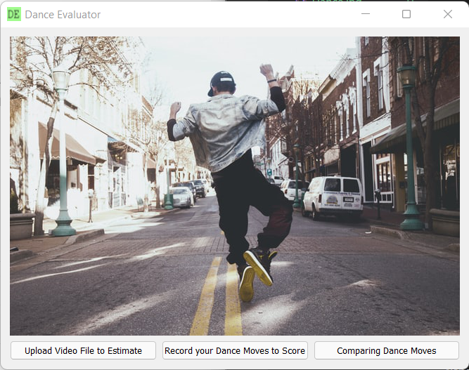

# Dance Evaluator

### Abstract

**The health benefits of dancing are tremendous; it boosts immunity and cognitive capabilities in children. It also helps prevent osteoporosis in older women. Unfortunately, one of the most common reasons for people to shy away from dance is the fear of embarrassment that comes with doing it wrong. Our goal with this project is to provide a platform to evaluate dance moves and help overcome this fear. In our application, we record the user's dance moves and calculate accuracy. We utilize Mediapipe BlazePose GHUM and Dynamic Time Warping respectively for pose estimation and accuracy calculation.**

### Proposed Method
**Block Diagram**

### References
1. [Dance and early childhood cognition: The Isadora Effect](https://www.tandfonline.com/doi/abs/10.1080/10632913.2016.1245166)
2. [Health benefits of dancing activity among Korean middle-aged women](https://www.tandfonline.com/doi/full/10.3402/qhw.v11.31215)
3. [Feasibility of home exercises to enhance the benefits of tango dancing in people with Parkinson’s disease](https://www.sciencedirect.com/science/article/abs/pii/S0965229918302401)
4. [Depression, Social Isolation, and the Lived Experience of Dancing in Disadvantaged Adults](https://www.sciencedirect.com/science/article/abs/pii/S0883941715002472)
5. [Everybody Dance Now](https://arxiv.org/abs/1808.07371)
6. [LightTrack: A Generic Framework for Online Top-Down Human Pose Tracking](https://openaccess.thecvf.com/content_ECCV_2018/html/Bin_Xiao_Simple_Baselines_for_ECCV_2018_paper.html)
7. [Simple Baselines for Human Pose Estimation and Tracking](https://openaccess.thecvf.com/content_ECCV_2018/html/Bin_Xiao_Simple_Baselines_for_ECCV_2018_paper.html)
8. [Offline Reinforcement Learning: Tutorial, Review, and Perspectives on Open Problems](https://arxiv.org/abs/2005.01643)
9. [An Introduction to Deep Reinforcement Learning](https://arxiv.org/abs/1811.12560)

10. [Embed An OpenCV Video Feed in A PyQt Window Using QThread](https://youtu.be/dTDgbx-XelY)

11. [Use PyQt's QThread to Prevent Freezing GUIs](https://realpython.com/python-pyqt-qthread/)
12. [Deploying PyQt applications](https://wiki.python.org/moin/PyQt/Deploying_PyQt_Applications)
13. [PyQt Layouts: Create Professional-Looking GUI Applications](https://realpython.com/python-pyqt-layout/)

**Research Paper** : [Dance pose evaluation using monocular input device utilizing Dynamic Time Warping and Mediapipe](https://docs.google.com/document/d/11QUKHrE8lfJrquCRYUuD5z4MYQ7jwniZ/edit?usp=sharing&ouid=109898272318264998018&rtpof=true&sd=true)

**Final Review Presentation**: [Dance Evaluator Project Phase II - Review 3](https://docs.google.com/presentation/d/16b55TySVrmrNTK0OevahmInwgZcI-1W6hezjWZb6eCo/edit?usp=sharing)

**Final Product Video Demonstration** : [Dance Evaluator YouTube Video Demonstration](https://youtu.be/4R-KjPlZjqs)

**Prototype** : [Initial Design](https://www.figma.com/proto/HegXr33zJvBt2zqdJmXvZD/Final-Year-Project?node-id=1%3A3&scaling=scale-down&page-id=0%3A1&starting-point-node-id=1%3A3) 

## Screenshots

